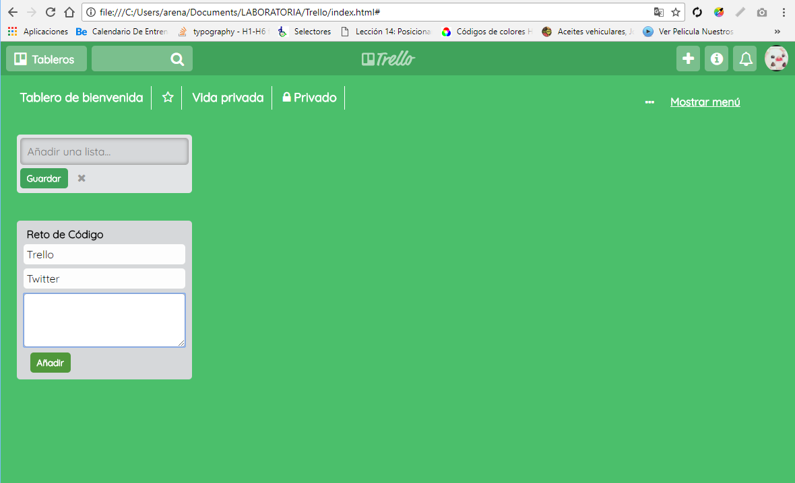

# Trello

***
## Se utilizó

`HTML`   `CSS` `JS`

## Descripción

Se trata de imitar la dinámica de la verdadera página de Trello, se puede agregar una lista y sus items(cards).
En este trabajo se ha aplicado todo lo parendido hasta ahora en **js**, **css** y **html**.

-El trabajo lo dividí en 3 secciones:
*Header
*Nav
*Section

## Trabajo terminado

## Especificaciones

* Esta web utilizó la tipografía: `Quicksand`.
* Los íconos de redes sociales puedes obtenerlos de [Font Awesome](http://fontawesome.io/).
* Para el formulario se utilizó las etiquetas como `form`, `input`, `button` `textarea`.

`Nota:`

*Este trabajo se ha subido a gh-pages [aquí](https://yaniraab.github.io/trello/).

